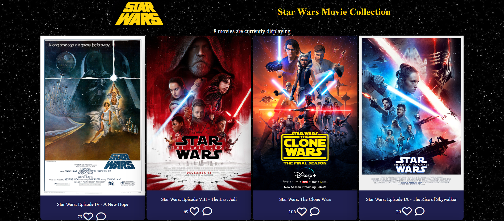
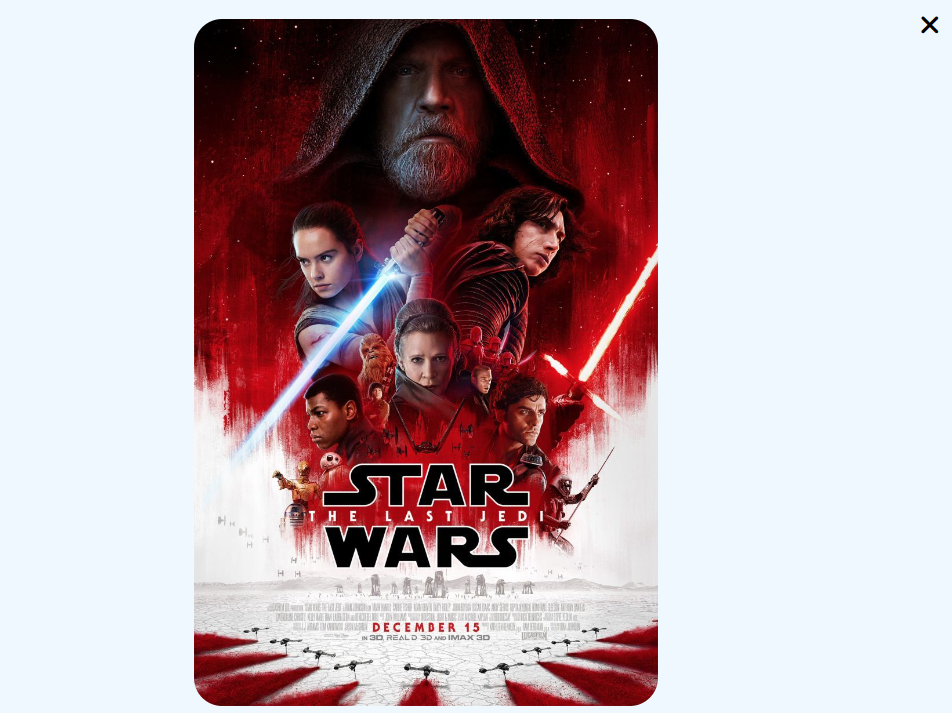

<a name="readme-top"></a>

<div align="center">

  
  <br/>

<h3><b>---</b></h3>

</div>

<!-- TABLE OF CONTENTS -->

# 📗 Table of Contents

- [📖 About the Project](#about-project)
  - [🛠 Built With](#built-with)
    - [Tech Stack](#tech-stack)
    - [Key Features](#key-features)
  - [🚀 Live Demo](#live-demo)
  - [🎥 Presentation](#video-link)
- [💻 Getting Started](#getting-started)
- [👥 Authors](#authors)
- [🔭 Future Features](#future-features)
- [🤝 Contributing](#contributing)
- [⭐️ Show your support](#support)
- [🙏 Acknowledgements](#acknowledgements)
- [📺 Presentation](#presentation)
- [📝 License](#license)

<!-- PROJECT DESCRIPTION -->

# StarWars Movies Collection <a name="about-project"></a>

In this project, My partner and I recreated a simple wireframe template for a Movie Site. This simple web page was built using webpack, fetching data from APIs and serving it by a webpack dev server.




## 🛠 Built With <a name="built-with"></a>

### Tech Stack <a name="tech-stack"></a>
# Major languages
- HTML
- CSS
- JS
- Jest.
## Technologies used: 
- Webpack
- VSCode
- git
-  GitHub
- Gitflow
- [Movies API](https://search.imdbot.workers.dev)
- [Involvement API](https://us-central1-involvement-api.cloudfunctions.net/capstoneApi/apps/)

<!-- Features -->
### Key Features <a name="key-features"></a>
- Like a movie
- Create a comment for a movie

<p align="right">(<a href="#readme-top">back to top</a>)</p> 

<!-- LIVE DEMO -->

## 🚀 Live Demo <a name="live-demo"></a>

[Live Demo Link]()

<p align="right">(<a href="#readme-top">back to top</a>)</p>

## 📺 Presentation <a name="video-link"></a>

[Presentation about this project]()

<p align="right">(<a href="#readme-top">back to top</a>)</p>

<!-- GETTING STARTED -->

## 💻 Getting Started <a name="getting-started"></a>

To get a local copy up and running, follow these steps:
### Prerequisites

In order to run this project you need:

- Code Editor: VS Code
- Web Browser
- Node
- Git
 ### Setup 
- Clone the repository
- Change directory into the project folder

Example commands:

```sh
  git clone git@github.com:billymohajeri/Capstone-Project-02.git
  cd Capstone-Project-02/
```

### Install 

Install this project with: 

Example command:

``` npm install ```

 ### Usage

To run the project, execute the following command:

`npm run build`
`npm start`

 ### Run tests

To run tests, run the following command: 

Example command:

 `npm test` 

 <p align="right">(<a href="#readme-top">back to top</a>)</p> 

<!-- AUTHORS -->

## 👥 Authors <a name="authors"></a>

<!-- > Mention all of the collaborators of this project. -->

👤 **Billy Mohajeri**

- GitHub: [@BillyMohajeri](https://github.com/billymohajeri)
- Twitter: [@BillyMohajeri](https://twitter.com/BillyMohajeri)
- LinkedIn: [@BillyMohajeri](https://www.linkedin.com/in/billymohajeri)

👤 **Emmanuella Adu**
- GitHub: [@elarhadu](https://github.com/elarhadu/)
- Twitter: [@elarh_](https://twitter.com/elarh_)
- LinkedIn: [Emmanuella Adu](https://www.linkedin.com/in/emmanuella-adu/)

<p align="right">(<a href="#readme-top">back to top</a>)</p>

<!-- FUTURE FEATURES -->

 ## 🔭 Future Features <a name="future-features"></a>

- Add a mobile version
- Add a search for other movies or series options

<p align="right">(<a href="#readme-top">back to top</a>)</p> 

<!-- CONTRIBUTING -->

## 🤝 Contributing <a name="contributing"></a>

Contributions, issues, and feature requests are welcome!

Feel free to check the [issues page](../../issues/).

<p align="right">(<a href="#readme-top">back to top</a>)</p>

<!-- SUPPORT -->

## ⭐️ Show your support <a name="support"></a>

If you like this project, you can support me by giving a ⭐.

<p align="right">(<a href="#readme-top">back to top</a>)</p>

<!-- ACKNOWLEDGEMENTS -->

## 🙏 Acknowledgments <a name="acknowledgements"></a>

<!-- > Give credit to everyone who inspired your codebase. -->

I would like to thank all of my code reviewers for giving me constructive feedback.

<p align="right">(<a href="#readme-top">back to top</a>)</p>

<!-- LICENSE -->

## 📝 License <a name="license"></a>

This project is [MIT](./LICENSE/MIT.md) licensed.

<p align="right">(<a href="#readme-top">back to top</a>)</p>

